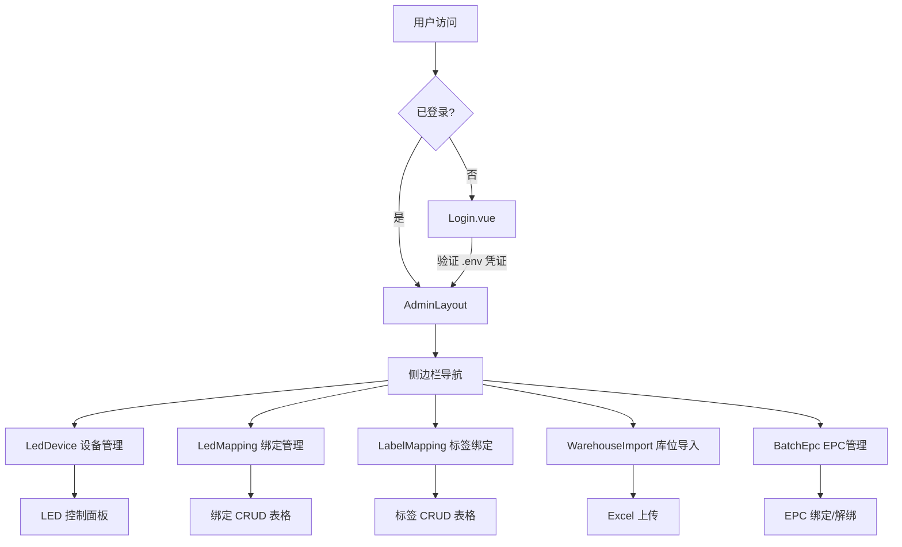

## 0. 术语约定

| 术语 | 定义 | 防冲突结论 |
|---|---|---|
| DXHP | 东信和平（dongxinheping）插件缩写 | 仅限本文档使用，不进入代码命名 |
| PDA 页面 | 现有 `static/pda/*.html` React 手持终端页面 | 保留不删，新 admin 面向桌面管理 |
| Admin Panel | 本 feature 要建的独立前端项目 | 项目名 `dongxinheping-admin` |
| LED 映射 | 库位码 → 巷道灯设备的绑定关系（`t_location_led`） | 对应 PDA 的 `led-mapping.html` |
| 标签映射 | 库位码 → 电子标签码的绑定关系 | 对应 PDA 的 `location-label-mapping.html` |
| 亮灯链路 | 拣货上传 → 亮灯控制 → 拣货完成的完整业务流 | 对应 PDA 的 `light-chain-simulator.html` |

## 1. 决策与约束

### 需求摘要

为 DXHP 插件搭建一个独立的桌面端管理后台，将现有 PDA 手持终端页面的单条操作升级为表格化 CRUD 管理。技术栈锁定 Vue3 + Vite + Naive UI。登录凭证通过配置文件设置。

**为谁**：仓库管理员（桌面端），区别于 PDA 手持终端的操作员。

**成功标准**：所有 PDA 页面功能在桌面端可操作，且表格化操作效率高于 PDA 单条模式。

**明确不做**：
- 不替换/删除现有 PDA 页面，两者并存
- 不接入 Sa-Token 认证体系（使用独立配置认证）
- 不做移动端适配（纯桌面管理后台）
- 不做亮灯链路模拟器（那是开发调试工具，不是管理功能）
- 不做 RFID 控制页面（PDA 专属硬件操作）

### 复杂度档位

走"项目内部工具"默认档位，无偏离。健壮性=L2，结构=modules，性能=reasonable，可读性=team，可演进性=active。

### 关键决策

**D1: 独立项目 vs 纳入 magic-boot-vben monorepo**
选择独立项目 `dongxinheping-admin/`。理由：DXHP 是 PF4J 插件，管理后台应独立于主项目的前端体系，降低耦合。纳入 monorepo 会引入工作空间、菜单注册等不必要的复杂度。

**D2: 前端配置认证 vs 后端登录 API**
选择前端配置认证（`.env` + `localStorage`）。理由：现有后端 API 均为 `require_login=false`，内部工具在私有网络部署，前端认证足以满足"防止误访问"的需求。后端无需新增登录接口。

**D3: 构建产物部署方式**
Vite 构建输出配置为 `magic-plugin-dongxinheping/src/main/resources/static/admin/`，随插件一起打包。开发时用 Vite dev server + proxy 指向 `localhost:8090`。

**被拒方案**：纳入 magic-boot-vben（过于复杂）、后端 Sa-Token 认证（现有 API 无需登录，引入认证需改所有 .ms 文件）。

## 2. 名词与编排

### 2.1 名词层

**现状**：DXHP 插件有 7 个 PDA 静态页面（React + antd-mobile），通过 fetch 调用 magic-api 端点操作 `t_location_led`、`t_location_warehouse`、`t_batch_epc` 等表。无桌面管理界面。

**变化**：新增独立 Vue3 项目，通过相同的 API 端点实现表格化管理。需新增 2 个后端列表查询 API（LED 映射列表、标签映射列表）。

#### 页面与 API 映射

| Admin 页面 | 对应 PDA 页面 | 复用的 API | 需新增的 API |
|---|---|---|---|
| LED 设备管理 | aisle-led-control.html (设备列表部分) | `GET /api/location/led-devices` | — |
| 库位-LED 绑定 | led-mapping.html | `POST/DELETE /api/location/led-mapping` | `GET /api/location/led-mapping/list`（分页） |
| 库位-标签绑定 | location-label-mapping.html | `POST/DELETE /api/location/label-mapping` | `GET /api/location/label-mapping/list`（分页） |
| LED 设备控制 | aisle-led-control.html (控制部分) | `POST /api/location/led-device-control` | — |
| 库位导入 | warehouse-location-import.html | `POST /api/location/warehouse-location/import` | — |
| 批次 EPC 管理 | batch-epc.html | `GET /api/location/batch-epc/list`、`POST bind/unbind` | — |

#### 核心数据结构

```typescript
// LED 设备
interface LedDevice { macAddress: string; ip: string; remark: string }

// 库位-LED 绑定
interface LocationLedBinding { id: string; locationCode: string; ledId: string; color: 'RED'|'YELLOW'|'GREEN'; status: number }

// 库位-标签绑定
interface LocationLabelBinding { id: string; locationCode: string; labelCode: string; bindTime: string }

// 批次 EPC 绑定
interface BatchEpcBinding { id: string; batchId: string; epc: string; status: number; bindTime: string; unbindTime?: string }

// 库位导入结果
interface ImportResult { totalRows: number; successCount: number; failCount: number; errors: Array<{rowNo: number; message: string}> }

// LED 控制命令
interface LedControlCommand { ledId: string; command: 'ON'|'OFF'; port: 'ALL'|'RED'|'YELLOW'|'GREEN'; timeoutMs?: number }
```

#### 项目目录结构

```
dongxinheping-admin/
├── index.html
├── package.json
├── vite.config.ts
├── tsconfig.json
├── .env                        # VITE_API_BASE_URL, VITE_ADMIN_USER, VITE_ADMIN_PASS
├── .env.development            # dev 覆盖
├── src/
│   ├── main.ts
│   ├── App.vue
│   ├── api/                    # API 调用封装
│   │   ├── request.ts          # axios 实例 + 拦截器
│   │   ├── led-device.ts       # LED 设备 API
│   │   ├── led-mapping.ts      # 库位-LED 绑定 API
│   │   ├── label-mapping.ts    # 库位-标签绑定 API
│   │   ├── batch-epc.ts        # 批次 EPC API
│   │   └── warehouse.ts        # 库位导入 API
│   ├── auth/                   # 认证模块
│   │   └── index.ts            # login/logout/isAuthenticated
│   ├── router/
│   │   └── index.ts            # 路由配置 + 守卫
│   ├── layouts/
│   │   └── AdminLayout.vue     # 侧边栏 + 顶栏布局
│   ├── views/
│   │   ├── Login.vue
│   │   ├── Dashboard.vue
│   │   ├── LedDevice.vue       # LED 设备列表 + 控制
│   │   ├── LedMapping.vue      # 库位-LED 绑定管理
│   │   ├── LabelMapping.vue    # 库位-标签绑定管理
│   │   ├── WarehouseImport.vue # 库位 Excel 导入
│   │   └── BatchEpc.vue        # 批次 EPC 管理
│   └── types/
│       └── index.ts            # TypeScript 类型定义
```

### 2.2 编排层



**现状**：PDA 页面各自独立，无统一导航和认证。每个页面独立 fetch API。

**变化**：统一到 AdminLayout 布局，共享认证状态、axios 实例和错误处理。每个 view 调用对应 api 模块的方法。

**流程级约束**：
- 登录凭证仅在前端校验（`localStorage` 存储认证状态），API 调用不携带 auth header
- API 错误统一由 axios 拦截器处理：`code !== 200` 时弹出 Naive UI `useMessage` 提示
- LED 控制命令无确认重试机制，发送即执行
- Excel 导入限制文件大小 10MB，仅接受 `.xlsx/.xls`

### 2.3 挂载点清单

| 挂载位置 | 动作 |
|---|---|
| `magic-plugin-dongxinheping/src/main/resources/static/admin/` | 新增 — Vite 构建产物输出目录 |
| `dongxinheping-admin/.env` | 新增 — 管理员登录凭证配置 |
| `dongxinheping-admin/vite.config.ts` → `server.proxy` | 新增 — API 代理到后端 |
| `data/dongxinheping/api/东信和平/库位/` | 新增 — 2 个列表查询 .ms 文件 |

### 2.4 推进策略

```
1. 项目骨架：Vite + Vue3 + Naive UI + 路由 + 布局 + 认证
   退出信号：npm run dev 能看到登录页，登录后跳转到空 Dashboard

2. API 层 + 类型定义：封装 axios + 所有 API 模块
   退出信号：类型完整，API 函数可调用（dev proxy 联通后端）

3. 业务页面（逐个）：LED 设备 → LED 绑定 → 标签绑定 → 库位导入 → EPC 管理
   退出信号：每个页面可独立 CRUD 操作

4. 后端补齐：新增 LED 映射列表 API + 标签映射列表 API
   退出信号：前端表格能分页展示绑定数据

5. 样式收尾 + 构建配置：输出到 plugin static/admin/
   退出信号：构建产物可被 Spring Boot 正常服务
```

### 2.5 结构健康度与微重构

##### 评估

- 文件级 — 无现有文件需要修改（纯新增项目）
- 目录级 — `dongxinheping-admin/` 为全新项目目录，不存在摊平问题

##### 结论：不做

本次 feature 是纯新建项目，不涉及现有文件修改。新项目目录从空开始，结构按 2.1 节定义的组织。

##### 超出范围的观察

- 现有 PDA 页面使用 React + antd-mobile（CDN 方式），与新的 Vue3 admin 面板技术栈不同。未来如有统一需求，建议走 `cs-refactor` 评估是否迁移 PDA 页面到 Vue3。
- 后端 `require_login=false` 的 API 在公网部署时存在安全风险。如有公网暴露可能，建议走 `cs-decide` 确定认证策略。

## 3. 验收契约

### 关键场景清单

**登录**
- 输入正确凭证 → 跳转到 Dashboard，侧边栏可见
- 输入错误凭证 → 显示错误提示，停留在登录页
- 未登录直接访问管理页 → 重定向到登录页

**LED 设备管理**
- 进入页面 → 表格展示所有设备（MAC、IP、备注）
- 选择设备 → 执行开灯/关灯 → 显示执行结果

**库位-LED 绑定管理**
- 进入页面 → 分页表格展示绑定列表
- 填写库位码 + 选择设备 + 选择颜色 → 创建成功，表格刷新
- 输入库位码 → 删除成功，表格刷新
- 创建重复绑定 → 显示错误提示

**库位-标签绑定管理**
- 进入页面 → 分页表格展示绑定列表
- 填写库位码 + 标签码 → 创建成功，表格刷新
- 输入标签码 → 解绑成功，表格刷新

**库位导入**
- 下载模板 → 得到 .xlsx 文件
- 上传合规文件 → 显示导入结果（总数/成功/失败/错误明细）
- 上传非 Excel 文件 → 显示格式错误提示

**批次 EPC 管理**
- 进入页面 → 分页表格展示绑定列表（支持搜索）
- 填写批次ID + EPC → 绑定成功
- 点击解绑 → 确认后解绑成功
- 按批次ID或EPC搜索 → 显示匹配结果

### 明确不做的反向核对

- 代码中不应出现 `sa-token`、`StpUtil` 相关导入
- 不应存在移动端 viewport meta 或媒体查询
- 不应有 `/api/light/picking/upload`、`/api/light/picking/complete`、`/api/light/control` 的调用（亮灯链路模拟器功能）
- 不应有 RFID 控制 API 的调用

## 4. 与项目级架构文档的关系

本 feature 新增一个独立前端子系统 `dongxinheping-admin/`，与主项目 `magic-boot-vben` 平行存在。

- **名词**：Admin Panel 作为 DXHP 插件的桌面管理入口，与 PDA 页面并列。构建产物部署到插件 `static/admin/`，访问路径为 `/plugin/dongxinheping-plugin/static/admin/`。
- **动词骨架**：与 PDA 页面共享相同的后端 API 端点，但增加了表格列表查询能力（需后端补齐）。
- **流程级约束**：前端配置认证仅适用于私有网络部署场景。

acceptance 时应在 `ARCHITECTURE.md` 的"子系统 / 模块索引"新增 `dongxinheping-admin` 条目。
