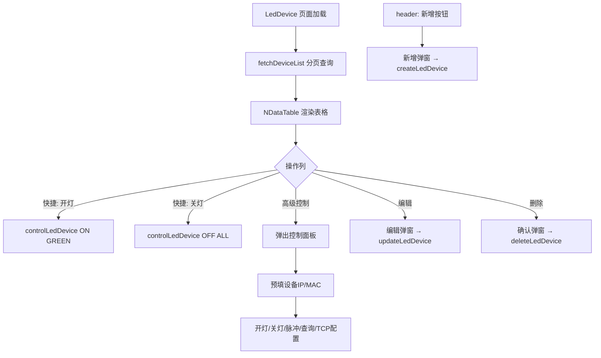

# 第 0 节：术语约定

| 术语 | 含义 | 代码映射 |
|---|---|---|
| LED 设备 | 巷道灯硬件，由 MAC 地址唯一标识 | `t_led_device` 表, `LedDevice` 类型 |
| 设备控制 | 向指定 LED 设备发送开灯/关灯/脉冲等指令 | `controlLedDevice` API / `zintis-led` 系列函数 |
| 操作列 | 表格每行的操作按钮区域 | NDataTable columns 最后一列 `fixed: 'right'` |

## 第 1 节：决策与约束

### 需求摘要

合并当前分散在两个页面（LedDevice + ZintisLedControl）的 LED 设备管理和控制功能为统一页面：设备表格支持分页查询和 CRUD，操作列可发送开灯/关灯/脉冲/查询等指令。合并后废弃 ZintisLedControl 页面和路由。

### 复杂度档位

走默认档位。单页面重构，后端新增 3 个简单 CRUD API，不跨子系统。

### 关键决策

**D1：ZintisLedControl 的底层 TCP 直控（手动填 IP/端口/命令码）如何融入表格交互？**
→ 操作列提供"控制"按钮，点击弹出控制面板弹窗，弹窗内包含：开灯/关灯/脉冲按钮 + 查询类命令 + TCP 配置。弹窗预填当前行设备的 IP 和 MAC，用户可修改后执行。底层仍调用 `zintis-led.ts` 的各函数。

**D2：设备查询从全量改为分页？**
→ 是。新增后端分页查询 API，和其他管理页面（LED 绑定、标签绑定、库存）保持一致模式。

**D3：已注册设备的快捷控制 vs 底层直控的关系？**
→ 操作列提供两套：
- **快捷按钮**：开灯（绿灯 ON）/ 关灯（ALL OFF），直接调用 `controlLedDevice` API，按 macAddress 查设备后发指令，一步完成
- **高级控制弹窗**：完整的 ZintisLedControl 功能（指定端口/颜色、脉冲、查询、TCP 配置），预填设备信息

### 明确不做

- 不改变 Zintis LED 插件本身的控制协议
- 不合并 LAN 扫描（ZintisLanScan）和 Netty 管理（ZintisNetty），这两个保持独立页面
- 不做设备状态的实时轮询/自动刷新
- 不删除 `zintis-led.ts` API 文件和 `ZintisLed*` 类型定义（新页面复用它们）

## 第 2 节：方案

### 2.1 名词层

**现状**（指向代码位置）：

| 名词 | 位置 | 说明 |
|---|---|---|
| `LedDevice` | `types/index.ts:2-6` | `{ macAddress, ip, remark }`，无 id 字段 |
| `LedControlCommand` | `types/index.ts:53-58` | `{ ledId, command, port, timeoutMs? }` |
| `LedControlResult` | `types/index.ts:61-70` | 控制结果 |
| `ZintisLedControlRequest` | `types/index.ts:101-109` | 底层直控请求 `{ deviceIp, devicePort, hostAddress, dataCommand, timeoutMs }` |
| `getLedDevices()` | `api/led-device.ts:4` | 返回 `LedDevice[]` 全量 |
| `controlLedDevice()` | `api/led-device.ts:8` | 按 ledId 发指令 |
| `zintis-led.ts` | `api/zintis-led.ts` | 底层直控系列函数（ON/OFF/Pulse/Query/TCP） |
| 查询 API | `查询巷道灯设备列表.ms` | `select mac_address, ip, remark from t_led_device`，全量返回 |

**变化**：

| 名词 | 变化 |
|---|---|
| `LedDevice` | 扩展：增加 `id` 字段（t_led_device 表是否有 id 列待确认，如无则用 macAddress 作主键） |
| 设备查询 API | 新增后端 `LED设备分页查询.ms`：分页 + 按 IP/备注模糊搜索，`db.page(sql)` |
| 设备新增 API | 新增后端 `新增LED设备.ms`：POST，插入 t_led_device |
| 设备编辑 API | 新增后端 `更新LED设备.ms`：PUT，更新 ip/remark |
| 设备删除 API | 新增后端 `删除LED设备.ms`：DELETE，按 id/macAddress 删除 |
| `getLedDevices()` | 改为 `getLedDeviceList(params)` 返回 `PageResult<LedDevice>` |
| `createLedDevice()` | 新增 |
| `updateLedDevice()` | 新增 |
| `deleteLedDevice()` | 新增 |

### 2.2 编排层

**主流程**：

**现状 → 变化**：

- 现状：LedDevice.vue 上半部分是设备列表，下半部分是独立的控制面板（下拉选设备→填命令→执行）
- 变化：统一为分页表格 + 操作列。控制面板改为弹窗，由操作列"控制"按钮触发，预填当前行设备信息

### 2.3 挂载点

| 挂载点 | 类型 | 说明 |
|---|---|---|
| `AdminLayout.vue` 菜单配置 | 注册 | 删除"设备控制"菜单项，保留"设备管理" |
| `router/index.ts` 路由 | 注册 | 删除 `zintis-control` 路由，`led-device` 路由指向重构后的页面 |
| 后端 `.ms` 文件（库位分组下） | 注册 | 新增 4 个 CRUD API 文件 |
| `api/led-device.ts` | 修改 | 扩展为 CRUD + 分页 |
| `api/zintis-led.ts` | 复用 | 不改，被新页面的控制弹窗 import |

### 2.4 推进策略

按 paradigm 维度切片：

1. **后端 CRUD API** — 新增 4 个 .ms 文件（分页查询、新增、更新、删除）
   - 退出信号：magic-api 管理页面可手动调用每个 API 返回正确结果
2. **前端 API 层 + 类型** — 扩展 `LedDevice` 类型、改造 `led-device.ts`
   - 退出信号：TypeScript 编译通过
3. **前端页面重构** — 重写 `LedDevice.vue`（分页表格 + CRUD 弹窗 + 操作列快捷按钮 + 高级控制弹窗）
   - 退出信号：浏览器可完成完整 CRUD 流程 + 操作列开灯/关灯 + 高级控制弹窗执行指令
4. **菜单和路由清理** — 删除 ZintisLedControl 路由和菜单项
   - 退出信号：侧边栏不再显示"设备控制"菜单

### 2.5 结构健康度

**文件级评估**：
- `LedDevice.vue`（118 行）将被重写，不存在偏胖问题
- `ZintisLedControl.vue`（158 行）将被废弃
- `led-device.ts`（10 行）将扩展，预计不超过 40 行，健康

**目录级评估**：
- `dongxinheping-admin/src/views/` 目录文件数合理，不拥挤
- `data/dongxinheping/api/东信和平/库位/` 目录文件数偏多但都是独立 .ms 文件，无需重组

**结论**：本次不做微重构，原因：所有涉及文件体量健康，改动是重写/新增而非往胖文件里追加。

## 第 3 节：验收契约

### 关键场景

| 编号 | 场景 | 输入 / 触发 | 期望可观察结果 |
|---|---|---|---|
| S1 | 分页查询 | 打开页面 / 翻页 / 改每页条数 | 表格显示分页数据，NPagination 显示正确总数 |
| S2 | 模糊搜索 | 输入 IP 或备注关键词 → 点查询 | 表格过滤为匹配记录，回到第 1 页 |
| S3 | 新增设备 | 点"新增" → 填 MAC/IP/备注 → 确认 | 新记录出现在列表中 |
| S4 | 编辑设备 | 点"编辑" → 修改 IP 或备注 → 确认 | 列表中对应行更新 |
| S5 | 删除设备 | 点"删除" → 确认弹窗 → 确认 | 记录从列表消失 |
| S6 | 快捷开灯 | 点操作列"开灯"按钮 | 调用 `controlLedDevice` ON/GREEN，显示成功/失败提示 |
| S7 | 快捷关灯 | 点操作列"关灯"按钮 | 调用 `controlLedDevice` OFF/ALL，显示成功/失败提示 |
| S8 | 高级控制弹窗 | 点"控制"按钮 → 弹窗打开 | 弹窗内预填当前行设备的 IP 和 MAC，可执行开/关/脉冲/查询/TCP 操作 |
| S9 | 底层直控执行 | 弹窗内点"脉冲" | 调用 `zintisControlPulse`，结果展示在弹窗内 |
| S10 | 菜单清理 | 查看侧边栏 | 不再有"设备控制"菜单项 |

### 反向核对项（明确不做的验证）

- ZintisLanScan 和 ZintisNetty 页面仍存在且路由正常
- `api/zintis-led.ts` 文件未被删除或修改
- `ZintisLed*` 类型定义未被删除

## 第 4 节：与项目级架构文档的关系

- `.codestable/architecture/ARCHITECTURE.md` 第 3 节 dongxinheping-admin 的"功能范围"描述需更新：将"LED 设备管理"扩展说明包含设备 CRUD + 控制
- 不涉及模块边界变更，不涉及跨模块接口
